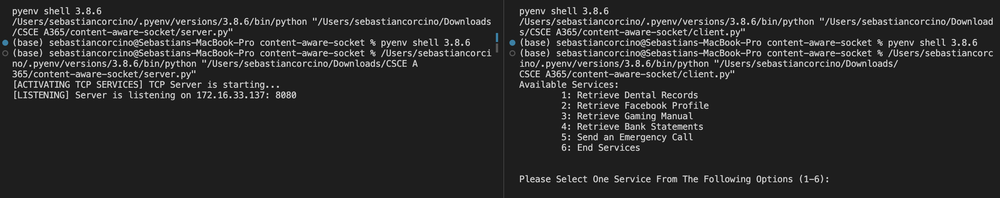

# Content Aware Socket Representation

## Overview

This project involves the implementation of TCP socket-based communication between server and multiple clients. The client are able to choose from a variety of services which ranges in downloading an assortment of PDFs and receiving JSON format payloads (API Simulated Calls).

## File Structure

- **Server:** Listens for incoming client connections using threads to handle each connection and there specific request.
- **Client:** Connects to the server and requests variety of services.

## Basic Usage

1. For each server and client update IP address to your current device IP address.
2. `python3 server.py`
3. `python3 client.py`
4. In the `client` terminal select optional services

Here is an Example if Project is Running Successfully.

### User Options

| Option Services | Name                      |
| --------------- | ------------------------- |
| `1`             | Retrieve Dental Records   |
| `2`             | Retrieve Facebook Profile |
| `3`             | Retrieve Gaming Manual    |
| `4`             | Retrieve Bank Statements  |
| `5`             | Send an Emergency Call    |
| `6`             | End Services              |

# Credits

DUSTINSTONE_BankStatement_3-9-1 - [source](https://templatelab.com/bank-statement/)

EMILYANDERSON_DentalHistory_11-21-20 - [source](https://fofhealthcenter.org/files/galleries/ada_health_history_english.pdf)

CRAFTING_GUIDE - [source](https://education.minecraft.net/wp-content/uploads/Crafting-Guide.pdf)
